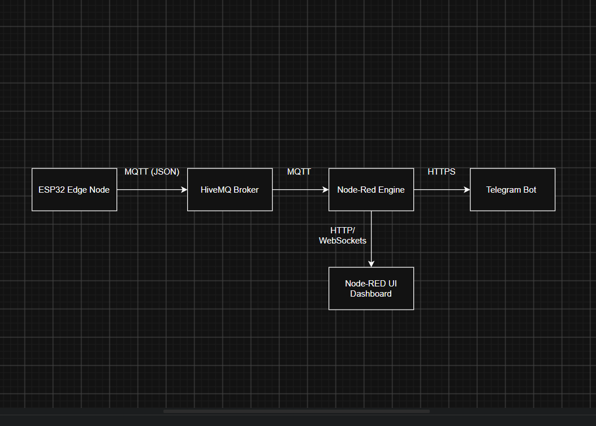
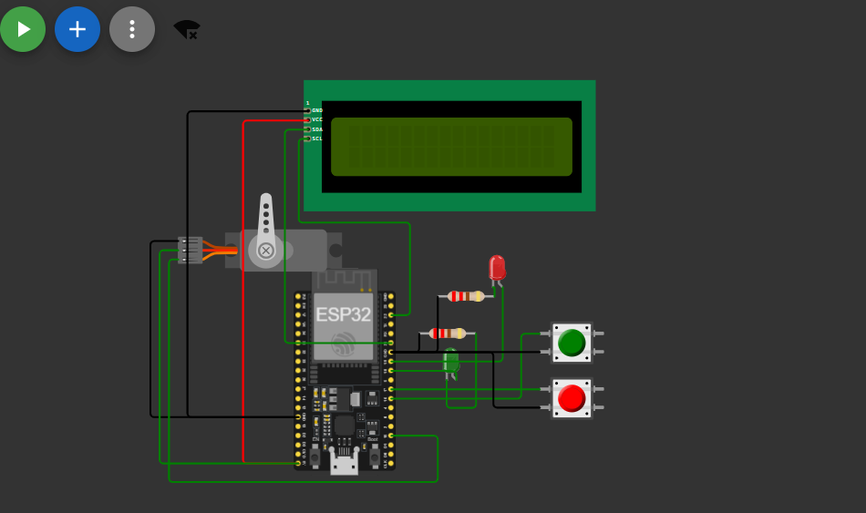
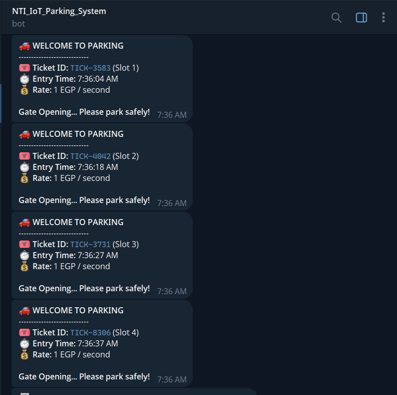
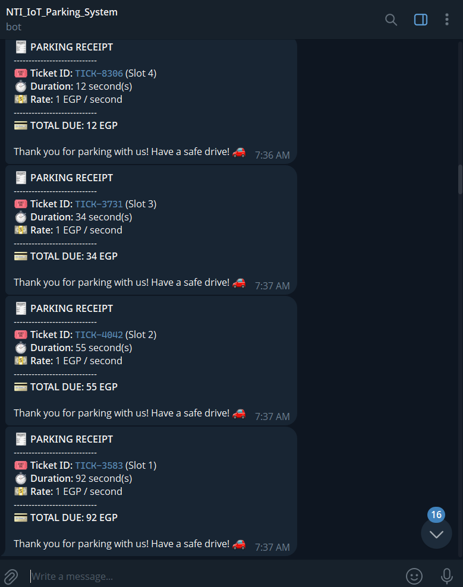

NTI IoT Parking System Project
This is the Graduation Project for the NTI Summer Internship (IoT)

Features :

-ESP32 Edge Device: Manages parking entry/exit gates, physical slot detection, and LCD status displays.
-MQTT Communication: Sends real-time parking slot telemetry via broker.hivemq.com .
-Node RED Middleware: Offloads time tracking, slot ticket management, and system analytics.
-Node RED UI Dashboard: Displays real-time occupied slot gauges and active capacity.
-Telegram Bot Billing: Automatically generates a unique Ticket ID on entry and calculates a 1 EGP/second receipt upon exit sent directly to the driver's Telegram.

System Architecture :

Node_Red Flow : 

Hardware Circuit : 

Telegram Bot Entry/Exit Messages : 

Project Repository Structure :

`main.py` — MicroPython source code for the ESP32.
`diagram.json` — Circuit schematic and pin wiring for Wokwi.
`flows.json` — Exported Node-RED flow configuration.
`i2c_lcd.py` — Low-level I2C communication protocol driver for the 16x2 LCD module.
`lcd_api.py` — Abstract interface class for managing character display formatting on the LCD.

You can test and run the full ESP32 circuit simulation live on Wokwi:

[Open Wokwi Simulation] : (https://wokwi.com/projects/470918554597260289)

***Exit Logic: LIFO (Last-In, First-Out)  -  Slot-based stack management.

Team Members & Contributions : 

[Mohamed Osama] - Embedded Hardware Lead - Developed ESP32 MicroPython firmware (main.py), Configured I2C LCD display drivers (i2c_lcd.py, lcd_api.py) Designed Wokwi circuit schematic & pin layout (diagram.json)

E-mail : mohamed2004.ma77@gmail.com

[Yousef Al-Demerdash] - Cloud & Middleware Lead - Built Node-RED flow engine (flows.json), Implemented Telegram Bot API integration & billing logic, Designed real-time Node-RED UI dashboard

Email : yousefaldemerdash@gmail.com

[Menna Allah Mohammed] - System Integration & Docs - System architecture design & end-to-end testing, Project documentation (README.md & technical report) MQTT payload & topic structure documentation

E-mail :mohammedhsharara@gmail.com
